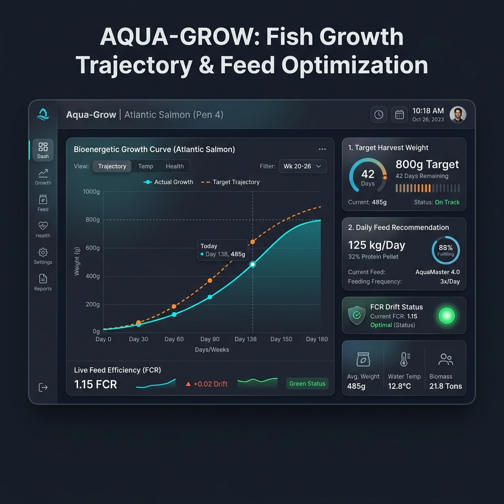
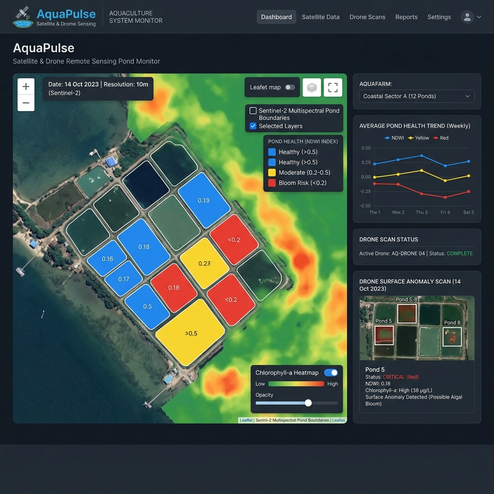
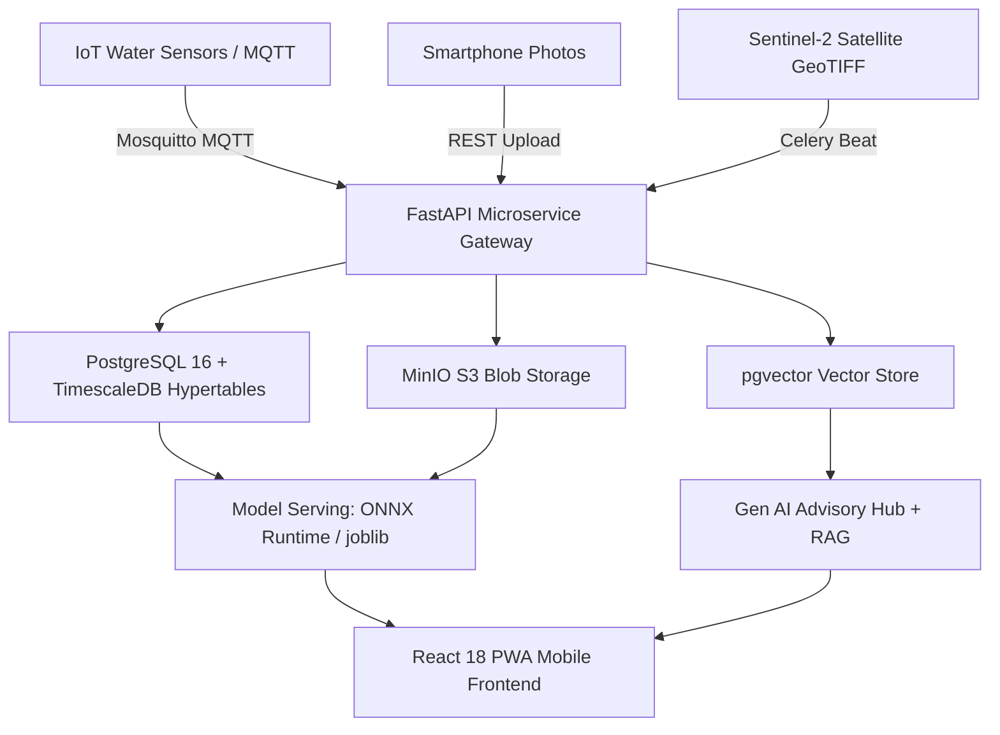

<div align="center">

# 🐟 Aquaculture Intelligence System (AIS)
### Next-Generation AI/ML Precision Aquaculture & Smart Farm Intelligence Platform

Developed & Engineered by **[Hariharan R](https://github.com/dev-hari-haran)** — *Lead ML & DL Developer*

[](https://github.com/dev-hari-haran)
[](https://python.org)
[](https://fastapi.tiangolo.com)
[](https://pytorch.org)
[](https://timescale.com)
[](https://docker.com)
[](LICENSE)

*An end-to-end multi-model AI system powering real-time IoT water quality forecasting, deep learning disease diagnosis, bioenergetic growth modeling, feed optimization, satellite pond remote sensing, and multilingual RAG advisory.*

</div>

---

## 👨‍💻 Lead Developer Spotlight

**Hariharan R** — *Lead Machine Learning & Deep Learning Engineer*
- **Specialization**: Computer Vision (PyTorch, EfficientNet, YOLOv8, U-Net), Time-Series Machine Learning (XGBoost, Isolation Forest), Bioenergetic Modeling & Generative AI Architectures.
- **GitHub Profile**: [dev-hari-haran](https://github.com/dev-hari-haran)
- **Project Scope**: Designed the 6-module AI core, mathematical feature engineering pipelines, database hypertables, model export runtimes (ONNX & TFLite FP16), and system architecture.

---

## 🌟 Executive Preview & User Interface Suite

### 1. Real-Time IoT Water Quality & Telemetry Dashboard
<div align="center">
  
  <p><i>Figure 1: Real-Time Glassmorphic PWA Dashboard showcasing live IoT telemetry, 72-hour forecasting, and fish stress risk scoring.</i></p>
</div>

<br/>

### 2. Computer Vision Disease Scanner & Diagnostic Engine
<div align="center">
  
  <p><i>Figure 2: 15-Class EfficientNet-B2 Computer Vision Scanner showing diagnostic confidence, severity grading, and ICAR-CIFA treatment protocols.</i></p>
</div>

<br/>

### 3. Bioenergetic Growth Trajectory & Feed Optimization Planner
<div align="center">
  
  <p><i>Figure 3: Bioenergetic biomass growth curve chart, target harvest weight countdown, optimal daily feed recommendation, and FCR drift status.</i></p>
</div>

<br/>

### 4. Sentinel-2 Multispectral Satellite Remote Sensing & Pond Boundary Segmentation
<div align="center">
  
  <p><i>Figure 4: Interactive Leaflet map displaying Sentinel-2 multispectral satellite pond boundaries, NDWI water indices, Chlorophyll-a algal bloom heatmaps, and drone scan overlays.</i></p>
</div>

---

## 🚀 Key AI Modules & System Architecture

The Aquaculture Intelligence System (AIS) integrates **6 core AI modules** engineered to solve critical bottlenecks across freshwater and marine fish farming (Rohu, Catla, Tilapia, Pangasius, Shrimp):

| Module | Lead Architecture | Models & Algorithms | Target Performance Metric |
| :--- | :--- | :--- | :--- |
| **1. Water Quality Monitor** | Real-time IoT anomaly detection & 72h forecast | Isolation Forest + XGBoost Regressors (x3) | DO Forecast MAPE < 8%, Anomaly Precision > 92% |
| **2. Fish Disease Detector** | 15-class disease classification & batch detection | PyTorch EfficientNet-B2 + YOLOv8-nano | Top-1 Accuracy > 88%, Latency < 200ms |
| **3. Growth Forecaster** | Bioenergetic biomass growth & harvest date | SGR Lookup + XGBoost Regressor/Classifier | Yield RMSE < 12%, Harvest Date ±5 days |
| **4. Feed Optimizer** | Daily feed quantity recommendation & FCR track | XGBoost Regressor + Environmental Rules | Feed Qty MAPE < 8%, FCR Reduction 15-20% |
| **5. Satellite Monitor** | Sentinel-2 multispectral satellite & U-Net land cover | ResNet34 U-Net + NDWI / Chl-a Indices | Pond Boundary IoU > 90%, Latency < 20min |
| **6. Gen AI Advisory Engine** | RAG-grounded LLM advisory, voice & PDF reports | Flexible LLM + pgvector HNSW Embedding | RAG Faithfulness > 91%, Response < 3s P95 |

---

## 📐 Mathematical & Bioenergetic Formulation

### 1. Bioenergetic Biomass Growth Formulation
Biomass accumulation is modeled using Specific Growth Rate (SGR) calibrated to ICAR-CIFA temperature lookup matrices:
$$W_{\text{current}} = W_{\text{initial}} \cdot e^{\text{SGR} \cdot \text{days}}$$
$$\text{Total Biomass} = W_{\text{current}} \cdot N_{\text{stocked}} \cdot (1 - \text{Mortality Rate})$$

### 2. Normalized Difference Water Index (NDWI) & Algal Bloom Proxy
Sentinel-2 multispectral band calculation for automated pond boundary extraction and algal bloom risk:
$$\text{NDWI} = \frac{B03 - B08}{B03 + B08} \quad (\text{Threshold } > 0.0 \rightarrow \text{Water Mask})$$
$$\text{Chlorophyll-a Proxy} = \frac{B03}{B04} \quad (\text{Algal Bloom Alert if } > 0.45)$$

### 3. Feed Conversion Ratio (FCR) Tracking
$$\text{FCR}_{\text{actual}} = \frac{\sum \text{Feed Delivered (kg)}}{\Delta \text{Biomass Gain (kg)}}$$

---

## 🏗️ System Workflow Architecture



---

## 📂 Complete Repository Layout

```
r:\Developments\AIS\
├── README.md                           # GitHub Project Showcase & Technical Manual
├── docker-compose.yml                  # Infrastructure Stack (FastAPI, TimescaleDB, Redis, MinIO, Mosquitto)
├── Dockerfile                          # FastAPI Container Build Configuration
├── requirements.txt                    # Python Dependencies Specification
├── .env.example                        # Environment Variables Template
│
├── User_Docs/                          # Master Documentation & PDF Blueprints
│   ├── PROJECT_PLAN_AND_HANDOVER.md       # Master Specification & Multi-Agent Reference
│   ├── AIS_5_Week_Implementation_Plan.pdf  # 5-Week Day-by-Day Implementation Blueprint PDF
│   ├── AIS_Dataset_Specifications_and_Types.pdf # Dataset Catalogue & Modalities PDF
│   ├── AIS_System_Architecture_and_Workflow_Flowchart.pdf # System Workflow Flowchart PDF
│   └── REPO_ISSUES_AND_BACKLOG.md         # Open Repository Issues & Backlog Tracker
│
├── backend/                            # FastAPI Microservices Backend
│   ├── main.py                         # Application Gateway Entry Point
│   ├── config.py                       # Pydantic Settings Configuration
│   ├── database/                       # PostgreSQL / TimescaleDB Hypertables Schema
│   └── routers/                        # REST & WebSocket API Routers
│
├── frontend/                           # Responsive Web Application Frontend
│   ├── index.html                      # PWA Web Client Interface
│   ├── styles.css                      # Modern Dark-Mode Glassmorphism Styling
│   └── app.js                          # Client-Side Telemetry & Chart.js Integration
│
├── models/                             # Machine Learning & Deep Learning Pipelines
│   ├── registry/                       # Model Artifacts Directory (.joblib, .onnx, .tflite)
│   └── train_water_quality.py          # User Model Training Script
│
├── ingestion/                          # Sensor Telemetry Schemas & MQTT Subscriber
├── preprocessing/                      # Tabular & Computer Vision Preprocessing Engines
└── docs/images/                        # UI Demonstration Screenshots & Graphics
```

---

## 🛠️ Installation & Local Setup

### 1. Clone & Configure Environment Variables
```bash
git clone https://github.com/dev-hari-haran/AQUA-INTELL.git
cd AQUA-INTELL
cp .env.example .env
```

### 2. Launch Infrastructure via Docker Compose
```bash
docker-compose up -d --build
```
*Access API Gateway at `http://localhost:8000/docs` and MinIO S3 Console at `http://localhost:9001`.*

### 3. Model Dataset Training (User Execution)
Executed by the user on your local GPU/machine for hyperparameter verification:
```bash
python models/train_water_quality.py
```

---

## 📅 5-Week Day-by-Day Roadmap Summary

- **Week 1 (Days 1–7)**: Infrastructure, Hypertables, MQTT Bridge & Water Quality Monitor
- **Week 2 (Days 8–14)**: Deep Learning — Fish Disease Detector (EfficientNet-B2, YOLOv8, TFLite FP16)
- **Week 3 (Days 15–21)**: Bioenergetics — Fish Growth & Yield Forecaster + Feed Optimization Engine
- **Week 4 (Days 22–28)**: Remote Sensing — Drone/Satellite Pond Monitor (Sentinel-2, ResNet34 U-Net)
- **Week 5 (Days 29–35)**: Generative AI Advisory Engine (RAG, Voice, Auto-PDF Reports) & Production Launch

---

## 📑 Technical PDF Documentation (`User_Docs/`)

All technical specifications are stored as styled PDF documents inside [User_Docs/](User_Docs/):
- [📄 Master Specification & Handover Guide (MD)](User_Docs/PROJECT_PLAN_AND_HANDOVER.md)
- [📄 5-Week Implementation Plan PDF](User_Docs/AIS_5_Week_Implementation_Plan.pdf)
- [📄 Dataset Specifications & Data Types Catalogue PDF](User_Docs/AIS_Dataset_Specifications_and_Types.pdf)
- [📄 System Architecture & Workflow Flowchart PDF](User_Docs/AIS_System_Architecture_and_Workflow_Flowchart.pdf)
- [📄 Repository Issues & Backlog Tracker](User_Docs/REPO_ISSUES_AND_BACKLOG.md)

---

<div align="center">
  <p><b>Developed by <a href="https://github.com/dev-hari-haran">Hariharan R</a> • Lead ML & DL Developer</b></p>
  <p>Star ⭐ this repository if you find this aquaculture AI project valuable!</p>
</div>
