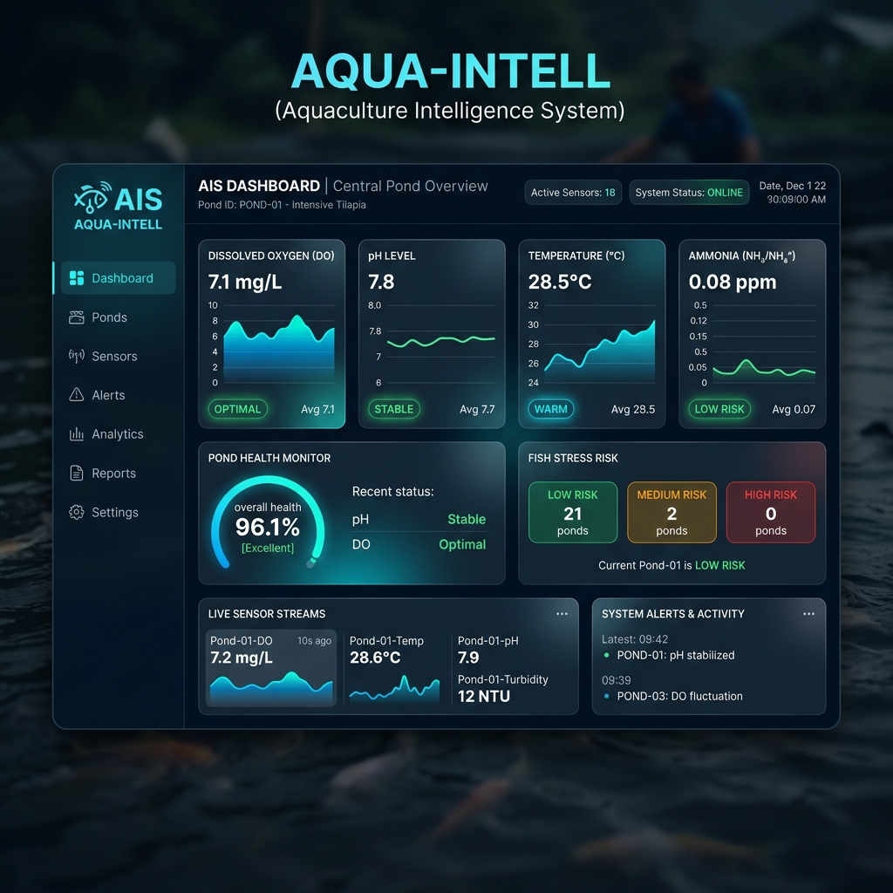
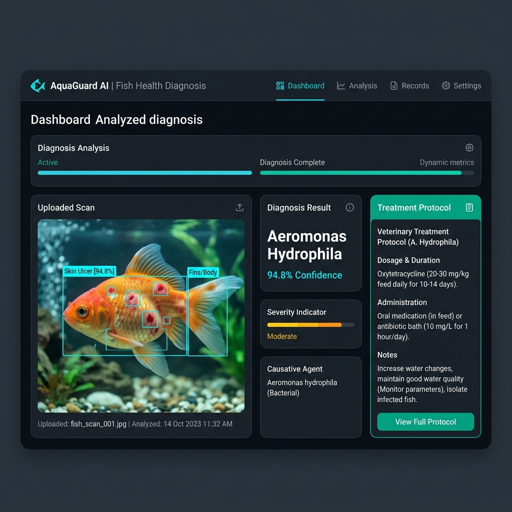
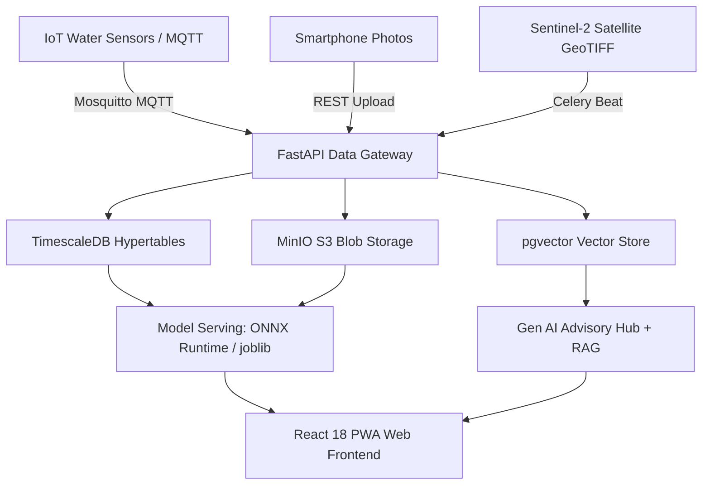

<div align="center">

# 🐟 Aquaculture Intelligence System (AIS)
### Next-Generation AI/ML Farm Management & Precision Aquaculture Platform

[](https://python.org)
[](https://fastapi.tiangolo.com)
[](https://pytorch.org)
[](https://timescale.com)
[](https://docker.com)
[](LICENSE)

*An end-to-end multi-model AI system powering real-time IoT water quality forecasting, deep learning disease diagnosis, bioenergetic growth modeling, feed optimization, satellite pond remote sensing, and multilingual RAG advisory.*

</div>

---

## 🌟 Executive Preview & User Interface

<div align="center">
  
  <p><i>Figure 1: Real-Time Glassmorphic PWA Dashboard showcasing live IoT telemetry, 72-hour forecasting, and stress risk scoring.</i></p>
</div>

<br/>

<div align="center">
  
  <p><i>Figure 2: Computer Vision Disease Scanner showing 15-class EfficientNet-B2 diagnostic output and ICAR-CIFA veterinary treatment protocols.</i></p>
</div>

---

## 🚀 Key Modules & AI Architecture

The platform integrates **6 core AI modules** spanning Machine Learning, Deep Learning, Remote Sensing, and Generative AI:

| Module | Primary Function | Model Architecture | Runtime Target | SLA / Target Metric |
| :--- | :--- | :--- | :--- | :--- |
| **1. Water Quality Monitor** | Real-time IoT anomaly detection & 72h parameter forecasting | Isolation Forest + XGBoost Regressors (x3) | joblib / FastAPI | DO Forecast MAPE < 8%, Precision > 92% |
| **2. Fish Disease Detector** | 15-class disease classification & multi-fish batch cropping | PyTorch EfficientNet-B2 + YOLOv8-nano | ONNX / TFLite FP16 | Top-1 Accuracy > 88%, Latency < 200ms |
| **3. Growth Forecaster** | Bioenergetic biomass growth & target harvest date prediction | SGR Lookup + XGBoost Regressor/Classifier | joblib / FastAPI | Yield RMSE < 12%, Harvest Date ±5 days |
| **4. Feed Optimizer** | Daily feed quantity recommendation (kg/day) & FCR drift tracking | XGBoost Regressor + Environmental Rules | joblib / FastAPI | Feed Qty MAPE < 8%, FCR Reduction 15-20% |
| **5. Satellite Pond Monitor** | Sentinel-2 multispectral imagery analysis & U-Net land cover | ResNet34 U-Net + NDWI / Chl-a Indices | PyTorch / ONNX | Pond Boundary IoU > 90%, Latency < 20min |
| **6. Gen AI Advisory Engine** | RAG-grounded LLM advisory, voice assistant & weekly PDF reports | Flexible LLM + pgvector HNSW Embedding | REST (SSE) + PyMuPDF | RAG Faithfulness > 91%, Latency < 3s P95 |

---

## 🏗️ System Architecture Workflow



---

## 📂 Project Directory Structure

```
r:\Developments\AIS\
├── README.md                           # GitHub Project Showcase & Quickstart Guide
├── docker-compose.yml                  # Infrastructure Stack (FastAPI, TimescaleDB, Redis, MinIO, Mosquitto)
├── Dockerfile                          # FastAPI Container Build Configuration
├── requirements.txt                    # Python Dependencies Specification
├── .env.example                        # Environment Variables Template
│
├── User_Docs/                          # Master Documentation & Technical Specifications
│   ├── PROJECT_PLAN_AND_HANDOVER.md       # Master Specification & Multi-Agent Guide
│   ├── AIS_5_Week_Implementation_Plan.pdf  # 5-Week Day-by-Day Implementation Blueprint PDF
│   ├── AIS_Dataset_Specifications_and_Types.pdf # Dataset Catalogue & Data Modalities PDF
│   └── AIS_System_Architecture_and_Workflow_Flowchart.pdf # Architecture Flowchart PDF
│
├── backend/                            # FastAPI Microservices Backend
│   ├── main.py                         # Application Entry Point
│   ├── config.py                       # Pydantic BaseSettings Configuration
│   ├── database/                       # PostgreSQL / TimescaleDB Migrations
│   └── routers/                        # REST & WebSocket API Routes
│
├── frontend/                           # Responsive Web Application Frontend
│   ├── index.html                      # PWA Web Client Interface
│   ├── styles.css                      # Modern Dark-Mode Glassmorphism Styling
│   └── app.js                          # Client-Side Telemetry & Chart.js Integration
│
├── models/                             # Machine Learning & Deep Learning Pipelines
│   ├── registry/                       # Model Artifacts Directory (.joblib, .onnx, .tflite)
│   └── train_water_quality.py          # User Model Training Script
│
├── ingestion/                          # Sensor Stream Telemetry & MQTT Subscriber
├── preprocessing/                      # Tabular & Computer Vision Preprocessing Engines
└── tests/                              # PyTest Unit & Integration Test Suite
```

---

## 🛠️ Quickstart & Local Setup

### 1. Clone & Set Up Environment Variables
```bash
git clone https://github.com/your-account/Aquaculture-Intelligence-System.git
cd Aquaculture-Intelligence-System
cp .env.example .env
```

### 2. Launch Multi-Container Infrastructure via Docker
```bash
docker-compose up -d --build
```
*Access API Gateway at `http://localhost:8000/docs` and MinIO S3 Console at `http://localhost:9001`.*

### 3. Model Training (User Instruction)
Model dataset training is executed by the user on your local GPU/machine for full hyperparameter control:
```bash
python models/train_water_quality.py
```

---

## 📅 5-Week Day-by-Day Roadmap Summary

- **Week 1 (Days 1–7)**: Infrastructure, Hypertables, MQTT Bridge & Water Quality Monitor
- **Week 2 (Days 8–14)**: Deep Learning — Fish Disease Detector (EfficientNet-B2, YOLOv8, TFLite FP16)
- **Week 3 (Days 15–21)**: Bioenergetics — Fish Growth & Yield Forecaster + Feed Optimization Engine
- **Week 4 (Days 22–28)**: Remote Sensing — Drone/Satellite Pond Monitor (Sentinel-2, ResNet34 U-Net)
- **Week 5 (Days 29–35)**: Generative AI Advisory Engine (RAG, Voice, Auto-PDF Reports) & Production Launch

---

## 📑 Technical PDF Documentation & Specifications (`User_Docs/`)

All technical blueprints are available as styled PDF specifications inside the [User_Docs/](User_Docs/) folder:
- [📄 Master Specification & Handover Guide (MD)](User_Docs/PROJECT_PLAN_AND_HANDOVER.md)
- [📄 5-Week Implementation Plan PDF](User_Docs/AIS_5_Week_Implementation_Plan.pdf)
- [📄 Dataset Specifications & Data Types Catalogue PDF](User_Docs/AIS_Dataset_Specifications_and_Types.pdf)
- [📄 System Architecture & Workflow Flowchart PDF](User_Docs/AIS_System_Architecture_and_Workflow_Flowchart.pdf)

---

<div align="center">
  <p><b>Star ⭐ this repository if you find this aquaculture AI project valuable!</b></p>
  <p>Created by the AIS AI Engineering Team • July 2026</p>
</div>
