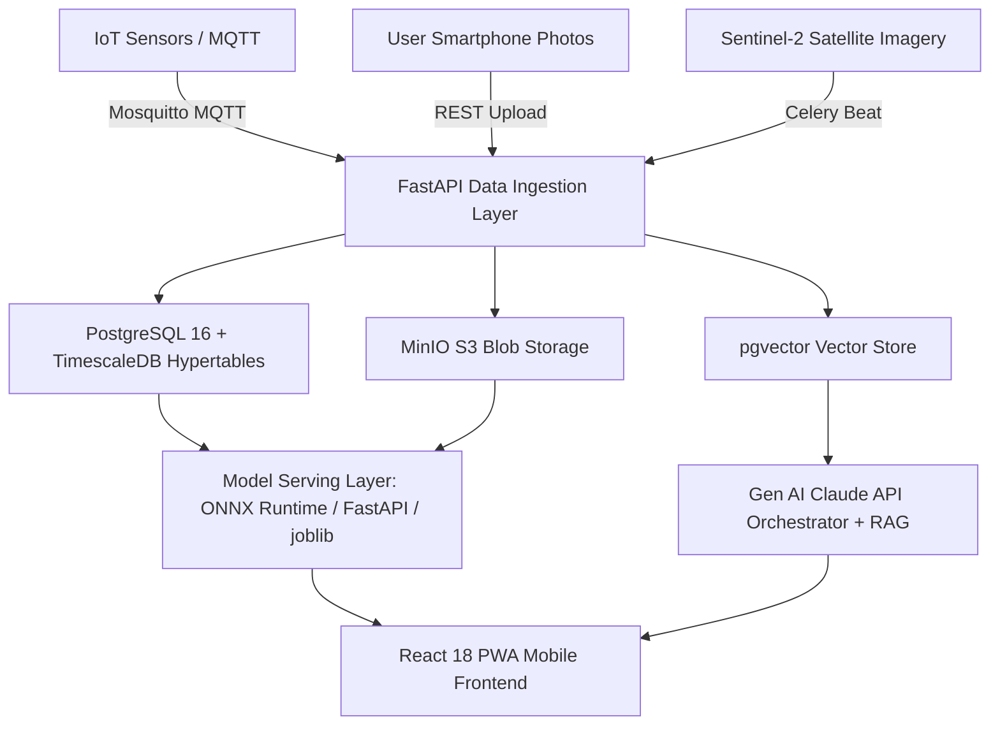

# Aquaculture Intelligence System (AIS)
## Master Project Specification, Multi-Agent Guide & 5-Week Implementation Plan

This document serves as the **authoritative reference manual** for the Aquaculture Intelligence System (AIS). It is specifically structured so that any current or future AI coding agent (or human engineer) can immediately understand the architecture, data flows, database schemas, model specifications, API contracts, execution guidelines, and implementation roadmap.

---

## 1. Executive Summary & Domain Scope

- **Project Title**: Aquaculture Intelligence System (AIS)
- **Domain**: Aquaculture / AgriTech / AI-ML Engineering
- **Target Platform**: Mobile-First Progressive Web App (React 18 + Tailwind CSS + Chart.js + Leaflet.js) + FastAPI microservices backend + Android TFLite (Offline mode)
- **Target Species**: Rohu, Catla, Tilapia, Pangasius, Shrimp (Vannamei/Monodon)
- **Geography**: India (Phase 1), Southeast Asia (Phase 2)
- **Key Modules**: 6 AI-Powered Modules spanning Machine Learning (ML), Deep Learning (DL), Remote Sensing, and Generative AI (Gen AI)

---

## 2. Multi-Agent & Human Collaboration Guidelines

### Division of Responsibilities (Execution Policy)

> [!IMPORTANT]
> **PRIMARY RULE**:
> 1. **Model Dataset Training**: Executed **exclusively by the USER** on their local/GPU system for personal satisfaction and hyperparameter verification. The agent scaffolds all clean PyTorch / Scikit-Learn / XGBoost / Prophet / U-Net training scripts, data loaders, split logic, and saving mechanisms, then provides clear one-line execution commands to the user.
> 2. **System Scaffolding & Command Execution**: Handled **autonomously by the AGENT**. The agent writes code, creates database migrations, builds REST & WebSocket endpoints, develops frontend UI components, manages Docker containerization, sets up ONNX/TFLite export scripts, runs unit/integration tests, and deploys the infrastructure.

---

## 3. High-Level Architecture & Technology Stack



### Technology Matrix

| Layer | Component | Technologies | Protocol / Format |
| :--- | :--- | :--- | :--- |
| **Frontend** | PWA Web Client | React 18, Tailwind CSS, Chart.js, Leaflet.js | HTTPS / REST / WebSockets |
| **Data Ingestion** | IoT Gateway & APIs | Mosquitto MQTT v5, FastAPI, Celery, Redis | MQTT / REST / GeoTIFF |
| **Data Storage** | Time-Series & Relational | PostgreSQL 16 + TimescaleDB 2.14+, pgvector, MinIO S3 | TCP/SQL, S3 API |
| **Model Serving** | Cloud Serving | FastAPI + ONNX Runtime, joblib, PyTorch | HTTPS / JSON / ONNX |
| **Offline Runtime** | Mobile On-Device | TFLite FP16 Runtime (Android native) | Local TFLite (~15MB) |
| **Gen AI & RAG** | Advisory Assistant | Claude 3.5 Sonnet / Sonnet 4-6, sentence-transformers (`all-MiniLM-L6-v2`), Whisper ASR, Google TTS / Bhashini | HTTPS / SSE Streaming |

---

## 4. Complete Database Schema (Key Hypertables & Tables)

### `sensor_readings` (TimescaleDB Hypertable - 7-day chunks)
- `pond_id`: UUID (FK)
- `ts`: TIMESTAMPTZ (Primary Time Column)
- `do_mgl`: FLOAT (Dissolved Oxygen in mg/L)
- `ph`: FLOAT (pH level 3-11)
- `temp_c`: FLOAT (Temperature in °C)
- `nh3_mgl`: FLOAT (Ammonia in mg/L)
- `turbidity`: FLOAT (Turbidity in NTU)
- `data_quality`: VARCHAR (`VALID`, `IMPAIRED`, `INVALID`)
- *Indexes*: Primary `(pond_id, ts)`, BRIN on `ts`, Partial on `data_quality`.

### `disease_events` (Standard PostgreSQL Table)
- `event_id`: UUID (PK)
- `pond_id`: UUID (FK)
- `image_path`: TEXT (MinIO object URI)
- `disease_class`: VARCHAR (15 classes)
- `confidence`: FLOAT (0.0 to 1.0)
- `severity`: VARCHAR (`Mild`, `Moderate`, `Severe`, `Critical`)
- `treatment_id`: INT
- `model_version`: VARCHAR
- `ts`: TIMESTAMPTZ
- *Indexes*: Composite `(pond_id, ts)`, B-Tree on `disease_class`.

### `pond_cycles` (Standard PostgreSQL Table)
- `cycle_id`: UUID (PK)
- `pond_id`: UUID (FK)
- `species`: VARCHAR (Rohu, Catla, Tilapia, Pangasius, Shrimp)
- `stocking_date`: DATE
- `n_fish`: INT
- `stocking_weight_g`: FLOAT
- `target_weight_g`: FLOAT
- `harvest_date`: DATE
- `status`: VARCHAR (`ACTIVE`, `HARVESTED`, `ABORTED`)

### `feed_logs` (Standard PostgreSQL Table)
- `log_id`: UUID (PK)
- `pond_id`: UUID (FK)
- `ts`: TIMESTAMPTZ
- `feed_kg`: FLOAT
- `feed_type`: VARCHAR
- `protein_pct`: FLOAT
- `fcr_actual`: FLOAT

### `rag_chunks` (PostgreSQL with pgvector extension)
- `chunk_id`: SERIAL (PK)
- `doc_source`: VARCHAR
- `section`: TEXT
- `page_num`: INT
- `content`: TEXT
- `embedding`: vector(384)
- *Indexes*: HNSW on `embedding` (`m=16`, `ef_construction=64`).

### `prediction_logs` (Standard PostgreSQL Table for MLOps PSI Monitoring)
- `log_id`: UUID (PK)
- `model_name`: VARCHAR
- `model_version`: VARCHAR
- `input_hash`: VARCHAR
- `prediction`: JSON
- `confidence`: FLOAT
- `latency_ms`: INT
- `ts`: TIMESTAMPTZ

---

## 5. System Modules & AI Model Specifications (6 Core Modules)

### Module 1: Water Quality Monitor & Predictor
- **Purpose**: Ingest continuous IoT sensor readings; produce real-time anomaly alerts, 24/48/72h parameter forecasts, Fish Stress Risk Score, and Algal Bloom probability.
- **Models Used**:
  - *Isolation Forest*: Unsupervised anomaly detection on 6-hr rolling windows (36 features, contamination=0.05).
  - *XGBoost Regressors (x3)*: 24h, 48h, 72h forecasts for DO, pH, NH3, Temperature.
  - *XGBoost Classifier*: Stress risk classification (`Low`, `Medium`, `High`, `Critical`).
- **Target Performance**: DO Forecast MAPE < 8%, pH Forecast MAPE < 10%, Anomaly Precision > 92%, Alert Latency < 2 min.

### Module 2: Fish Disease & Stress Detector
- **Purpose**: Classify fish disease from smartphone photos (15 classes) with severity grading and treatment lookup; multi-fish batch health detection via YOLOv8; offline execution via TFLite FP16.
- **Models Used**:
  - *EfficientNet-B2*: PyTorch transfer learning backbone, progressive unfreezing (freeze backbone -> unfreeze last 3 MBConv blocks after 5 epochs). Input: 224x224x3. Exported to ONNX & TFLite FP16 (~15MB).
  - *YOLOv8-nano*: Batch object detection on net-pull photos for fish bounding box cropping. Input: 640x640x3.
- **15 Disease Classes**: Aeromonas, Columnaris, Fin Rot, Dropsy, Saprolegnia, White Spot (Ich), Anchor Worm, Gill Flukes, KHV, EUS, Nutritional Deficiency, Ammonia Burn, Oxygen Stress, Healthy, Uncertain.
- **Target Performance**: Top-1 Accuracy > 88%, Macro F1 > 0.85, Critical Sensitivity > 93%, ONNX Latency < 120ms, TFLite Latency < 200ms.

### Module 3: Fish Growth & Yield Forecaster
- **Purpose**: Bioenergetic biomass estimation, t+7/t+14/t+30 weight trajectory forecasting, target weight harvest date prediction (with 10-day confidence interval), stocking density recommendation, and 30-day mortality risk.
- **Models Used**:
  - *Bioenergetic SGR Lookup*: Specific Growth Rate equation ($W_{current} = W_{initial} \cdot e^{SGR \cdot days}$) calibrated to ICAR-CIFA temperature lookup tables.
  - *XGBoost Regressor*: Growth trajectory forecasting.
  - *XGBoost Classifier*: Stocking density recommendation.
  - *Logistic Regression*: 30-day mortality risk model.
- **Target Performance**: Yield RMSE < 12% of target weight, Harvest Date Error ±5 days median.

### Module 4: Feed Optimization Engine
- **Purpose**: Daily feed quantity recommendation (kg/day), dawn/dusk feeding schedule, feed pellet protein % & size specification, and FCR drift monitoring.
- **Key Logic & Models**:
  - Environmental correction: Feed rate reduced 15-20% per 3°C below optimal temp; reduced 30% if DO < 4 mg/L.
  - *XGBoost Regressor*: Daily optimal feed kg/day prediction.
  - Rule-based Schedule: 60% morning, 40% evening based on diurnal DO cycle.
  - FCR Tracker: Trigger alert if actual FCR > 1.15x target for 7 consecutive days.
- **Target Performance**: Feed Qty MAPE < 8%, FCR Reduction vs baseline: 15-20%.

### Module 5: Drone/Satellite Pond Monitor
- **Purpose**: Sentinel-2 10m multispectral satellite imagery analysis (5-day revisit); compute NDWI for pond boundary mapping, Chlorophyll-a proxy for algal bloom risk, Turbidity index; U-Net land cover segmentation.
- **Models & Remote Sensing Formulas**:
  - NDWI = $\frac{B03 - B08}{B03 + B08}$ (Threshold 0.0 -> water mask)
  - Chlorophyll-a proxy = $\frac{B03}{B04}$ (Algal bloom alert if > 0.45)
  - Turbidity proxy = $\frac{B04}{B03}$
  - *U-Net (ResNet34 encoder)*: 4-class segmentation (water, vegetation, soil, structure).
- **Target Performance**: Pond Boundary IoU > 90%, Bloom Alert Precision > 85%.

### Module 6: Gen AI Advisory & Report Engine (Going Last)
- **Purpose**: Conversational AI assistant grounded in ICAR-CIFA/NACA/FAO knowledge, pond-specific context aggregation, automated weekly PDF health report generation, and regional language support via Whisper ASR & Google TTS/Bhashini.
- **Architecture**:
  - RAG Corpus: 2,000+ pages (~25,000 chunks of 400 tokens, 50 token overlap).
  - Embeddings: `sentence-transformers/all-MiniLM-L6-v2` (384 dimensions) in pgvector HNSW index.
  - Orchestration: Claude API (Claude 3.5 Sonnet / Sonnet 4-6) with function calling (`predict_disease`, `get_water_quality`, `get_growth_status`, `get_feed_recommendation`).
- **Target Performance**: RAG Faithfulness > 91%, Response Relevance > 87%, Latency < 3s P95.

---

## 6. Master 5-Week Day-by-Day Implementation Roadmap

```
+-----------------------------------------------------------------------------------+
|                            AIS 5-WEEK SPRINT OVERVIEW                             |
+-------------------+---------------------------------------------------------------+
| Week 1 (Days 1-7) | Infrastructure, Hypertables, MQTT & Water Quality Module     |
| Week 2 (Days 8-14)| Deep Learning: Fish Disease (EfficientNet-B2, YOLOv8, TFLite) |
| Week 3 (Days 15-21| Bioenergetics: Growth Forecaster & Feed Optimizer Engine      |
| Week 4 (Days 22-28| Remote Sensing: Drone/Satellite Pond Monitor (Sentinel-2)     |
| Week 5 (Days 29-35| Gen AI Advisory Engine (RAG, Voice, Reports) & System Launch  |
+-------------------+---------------------------------------------------------------+
```

### Detailed Day-by-Day Breakdown (Day 1 to Day 35)

#### **WEEK 1: Foundation, Infrastructure & Water Quality Monitor**
- **Day 1**: Scaffold repo, `.env.example`, `requirements.txt`, Docker Compose stack (FastAPI, TimescaleDB, Redis, MinIO, Mosquitto). *(Agent)*
- **Day 2**: Execute TimescaleDB hypertable SQL migrations (`sensor_readings`, `disease_events`, `pond_cycles`, `feed_logs`, `prediction_logs`). *(Agent)*
- **Day 3**: Implement Python Mosquitto MQTT subscriber bridge (`pond/{id}/sensors`) with Pydantic validation & TimescaleDB async writes. *(Agent)*
- **Day 4**: Build tabular preprocessor (`preprocessing/tabular.py`): range checks, Z-score spike filter, forward-fill/linear imputation, 15m/1h/6h rolling stats. *(Agent)*
- **Day 5**: Scaffold Isolation Forest anomaly detector & XGBoost 24/48/72h forecasting trainers (`train_water_quality.py`). *(User Train / Agent)*
- **Day 6**: Develop FastAPI routes (`/sensors/ingest`, `/sensors/live`, `/predict/water-quality`, `/predict/stress-risk`). *(Agent)*
- **Day 7**: Develop React PWA shell, Pond Card Grid, Chart.js live sensor time-series charts, and stress risk badges. *(Agent)*

#### **WEEK 2: Deep Learning — Fish Disease & Stress Detector**
- **Day 8**: Configure MinIO S3 bucket (`images/raw/`, `images/processed/`) & OpenCV image quality filter (resolution >= 64px, Laplacian blur > 80). *(Agent)*
- **Day 9**: Build Albumentations image augmentation pipeline & Claude API rare-class synthetic image generator script. *(Agent)*
- **Day 10**: Build PyTorch EfficientNet-B2 classifier backbone (progressive unfreezing) & training script `train_disease_efficientnet.py`. *(User Train / Agent)*
- **Day 11**: Build Ultralytics YOLOv8-nano multi-fish batch detection script & trainer `train_yolov8.py`. *(User Train / Agent)*
- **Day 12**: Implement model export pipeline: PyTorch -> ONNX (cloud serving) & TFLite FP16 (<15MB for offline Android). *(Agent)*
- **Day 13**: Build ICAR-CIFA Disease Knowledge JSON store & FastAPI endpoints `/predict/disease` and `/predict/batch-health`. *(Agent)*
- **Day 14**: Build React PWA Camera Widget component, diagnosis summary modal, severity indicators, and IndexedDB offline queue handler. *(Agent)*

#### **WEEK 3: Bioenergetics — Growth, Yield & Feed Optimization**
- **Day 15**: Build bioenergetic SGR calibration engine with ICAR-CIFA species lookup tables and biomass equation. *(Agent)*
- **Day 16**: Scaffold XGBoost growth forecaster & stocking recommender models script `train_growth_models.py`. *(User Train / Agent)*
- **Day 17**: Develop binary search harvest date predictor & Logistic Regression mortality risk trainer `train_mortality_model.py`. *(User Train / Agent)*
- **Day 18**: Build Feed Optimization Engine (temperature/DO rate adjustments) & XGBoost feed regressor trainer `train_feed_optimizer.py`. *(User Train / Agent)*
- **Day 19**: Implement dawn/dusk feed timing scheduler, FCR drift tracker ($\text{FCR} > 1.15\times$ target alert), and monthly feed budget calculator. *(Agent)*
- **Day 20**: Implement 6 REST endpoints: `/stocking/record`, `/predict/growth`, `/predict/harvest-date`, `/recommend/stocking`, `/optimize/feed`, `/track/fcr`. *(Agent)*
- **Day 21**: Develop React UI components: Growth Curve Chart, Harvest Date Countdown, Daily Feed Recommendation card, FCR alert banner. *(Agent)*

#### **WEEK 4: Remote Sensing (Drone/Satellite Pond Monitor)**
- **Day 22**: Implement Celery task for weekly Sentinel Hub API Sentinel-2 L2A GeoTIFF download (bands B02-B11) with cloud filter (<20%). *(Agent)*
- **Day 23**: Develop NDWI, Chlorophyll-a proxy, Turbidity index computation algorithms and 30-day baseline change detection rasters. *(Agent)*
- **Day 24**: Implement ResNet34 U-Net segmentation architecture for pond boundary extraction (>90% IoU) and trainer script `train_unet_segmentation.py`. *(User Train / Agent)*
- **Day 25**: Configure GeoTIFF tile server in MinIO S3 object storage and cache 7-day satellite rasters. *(Agent)*
- **Day 26**: Build surface anomaly classification handler for farmer-uploaded drone photos. *(Agent)*
- **Day 27**: Implement FastAPI satellite endpoints (`/satellite/pond-map/{farm_id}`, `/satellite/bloom-risk/{farm_id}`, `/drone/analyze`). *(Agent)*
- **Day 28**: Develop React Leaflet.js interactive map component rendering color-coded NDWI/Chlorophyll overlays with timeline controls. *(Agent)*

#### **WEEK 5: Generative AI Advisory Engine (Going Last) & Production Launch**
- **Day 29**: Build PyMuPDF text extractor & RecursiveCharacterTextSplitter (chunk_size=400 tokens, overlap=50) for ICAR-CIFA/FAO PDFs (~2,000 pages). *(Agent)*
- **Day 30**: Configure pgvector extension (HNSW index) & embedding generator script `generate_embeddings.py` (`all-MiniLM-L6-v2`). *(User Train / Agent)*
- **Day 31**: Develop Claude API orchestration engine (`modules/genai/orchestrator.py`) with function calling tools (`predict_disease`, `get_water_quality`, etc.). *(Agent)*
- **Day 32**: Integrate Whisper ASR voice transcription, Google TTS / Bhashini speech output, and ReportLab PDF report generator. *(Agent)*
- **Day 33**: Develop React PWA Chatbot UI (streaming SSE text, voice mic, citations, PDF download button). *(Agent)*
- **Day 34**: Perform cross-module microservice integration across all 6 modules, shared TimescaleDB/Redis, and Claude API router. Execute PyTest test suite (coverage > 80%). *(Agent)*
- **Day 35**: Deploy production stack via Docker Compose on Cloud VM with Nginx SSL, Sentry monitoring, Prometheus + Grafana dashboards, and MLflow model registry snapshot. *(Agent)*
